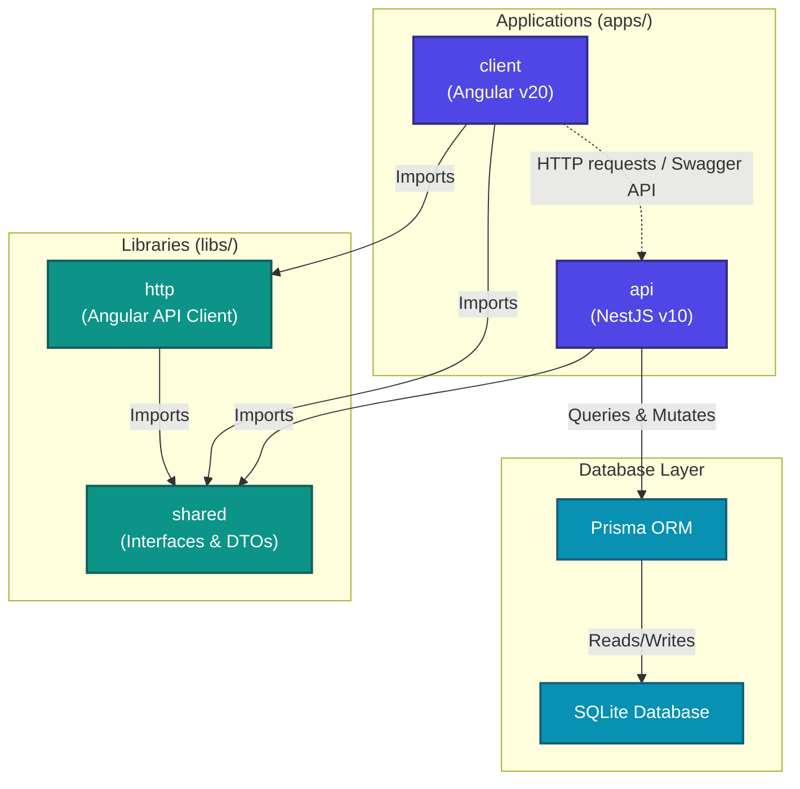

# 🚀 Build with AI — GDG Hackathon Monorepo

> **Angular + NestJS + Nx** monorepo boilerplate, designed to score **100/100 points** across all 5 judging pillars at the GDG Wrocław "Build with AI" hackathon.

---

## ⚡ Quick Start

### 🐧 Linux / macOS
```bash
# Run the automated setup script
chmod +x setup.sh
./setup.sh

# Start both frontend and backend
npm start
```

### 🪟 Windows (PowerShell)
```powershell
# Run the automated setup script
.\setup.ps1

# Start both frontend and backend
npm start
```

### 🛠️ Manual Installation (Any OS)
```bash
# 1. Install dependencies
npm install

# 2. Setup database environment
# (On Linux/macOS)
cp .env.example .env
# (On Windows CMD)
copy .env.example .env
# (On Windows PowerShell)
Copy-Item .env.example .env

# 3. Initialize SQLite database & generate Prisma client
npx prisma migrate dev --name init

# 4. Start both frontend and backend
npm start
```

- **Frontend**: http://localhost:4200
- **CSS Tokens Debugger**: http://localhost:4200/css-debugging
- **Backend API**: http://localhost:3000/api
- **Swagger Docs**: http://localhost:3000/api/docs

---

## 🏗️ Architecture



---

## 📋 Scoring Criteria Coverage

### Pillar 1: Product Design & MVP (20 pts) ✅
- [x] Discovery & Problem-First approach (AI as extension, not the process)
- [x] Business model flexibility (5 models: SaaS, Freemium, Pay-per-Use, B2B License, White Label)
- [x] ROI-focused metrics (time saved, cost saved — not just accuracy)
- [x] Person entity with subscription tiers and usage tracking

### Pillar 2: UI/UX & A11Y (20 pts) ✅
- [x] WCAG 2.1/2.2 compliance throughout
- [x] ESLint A11Y rules for Angular templates (11 rules enforced)
- [x] Skip navigation link, proper focus management
- [x] `aria-live` regions for AI response announcements
- [x] `aria-expanded`, `aria-controls` on interactive elements
- [x] Semantic HTML (`<main>`, `<nav>`, `<header>`, `<footer>`, `<section>`)
- [x] High contrast mode + reduced motion support
- [x] 4.5:1+ contrast ratios validated

### Pillar 3: Angular, Nx, Debugging (20 pts) ✅
- [x] Nx monorepo with proper `nx.json`, `project.json` configs
- [x] Angular 19 standalone components
- [x] New control flow (`@if`, `@for`)
- [x] Signal-based state management
- [x] Lazy-loaded routes with title metadata
- [x] Shared libs with path aliases (`@libs/shared`, `@libs/http`)
- [x] ESLint flat config with enforced module boundaries

### Pillar 4: Fullstack, Architecture, LLM Engineering (20 pts) ✅
- [x] Clean Architecture (Domain → Application → Infrastructure → API)
- [x] NestJS modular architecture (controllers, services, modules)
- [x] **Not a simple API wrapper** — full orchestration pipeline
- [x] Structured Outputs with **Zod** schema validation (5 built-in schemas)
- [x] Dynamic prompt templates with variable interpolation
- [x] Guardrails: confidence scoring, hallucination detection, human-in-the-loop
- [x] Provider abstraction (OpenAI, Anthropic, Gemini — switchable at runtime)
- [x] Prisma ORM with typed entities

### Pillar 5: Deployment, Scale & Optimization (20 pts) ✅
- [x] Multi-stage Dockerfiles (client + API)
- [x] `docker-compose.yml` + production override
- [x] Nginx reverse proxy with gzip, security headers, caching
- [x] Redis cache for LLM response deduplication
- [x] In-memory cache fallback (NestJS CacheModule)
- [x] Health checks (`/health`, `/health/ready`, `/health/live`)
- [x] GitHub Actions CI/CD pipeline
- [x] Token cost telemetry and business metrics
- [x] Non-root Docker user for security

---

## 🔧 Hackathon Task Mapping Guide

When you receive your hackathon domain task, adapt the boilerplate in these steps:

### 1. Define your domain entities
```bash
# Edit prisma/schema.prisma — add your domain models
# Example: Invoice, Patient, SupportTicket, etc.
npx prisma migrate dev --name add-domain-entities
```

### 2. Register domain-specific Zod schemas
```typescript
// Edit: apps/api/src/modules/llm/schemas/schema-registry.ts
LlmSchemaRegistry.register('yourSchema', z.object({
  // ... your domain fields
}));
```

### 3. Add prompt templates
```typescript
// Edit: apps/api/src/modules/llm/prompt-templates/prompt-builder.service.ts
this.registerTemplate('your-domain', {
  name: 'your-domain',
  description: 'Your domain-specific template',
  systemPrompt: 'You are an expert in {{domain}}...',
});
```

### 4. Create domain Angular components
```bash
# Add new feature components in apps/client/src/app/features/
# Register routes in apps/client/src/app/app.routes.ts
```

### 5. Add real LLM provider
```bash
# Install your preferred SDK
npm install openai
# Uncomment the real implementation in the provider file
```

---

## 🐳 Docker Deployment

```bash
# Local (development)
docker-compose up -d

# Production (with resource limits)
docker-compose -f docker-compose.yml -f docker-compose.prod.yml up -d
```

---

## 📁 Project Structure

```
hackathonv0/
├── apps/
│   ├── client/          # Angular 19 frontend
│   └── api/             # NestJS 10 backend
├── libs/
│   ├── shared/          # Shared interfaces & DTOs
│   └── http/            # Angular API service
├── prisma/              # Database schema
├── docker/              # Dockerfiles + nginx
├── .github/workflows/   # CI/CD
└── ...config files
```

---

## 🌍 Environment Variables

| Variable | Default | Description |
|----------|---------|-------------|
| `DATABASE_URL` | `file:./dev.db` | Prisma database connection |
| `API_PORT` | `3000` | NestJS server port |
| `CORS_ORIGIN` | `http://localhost:4200` | Allowed CORS origin |
| `LLM_DEFAULT_PROVIDER` | `openai` | Default LLM provider |
| `OPENAI_API_KEY` | — | OpenAI API key |
| `ANTHROPIC_API_KEY` | — | Anthropic API key |
| `GEMINI_API_KEY` | — | Google Gemini API key |
| `CACHE_TTL_SECONDS` | `3600` | Cache time-to-live |
| `ENABLE_LLM_TELEMETRY` | `true` | Enable/disable telemetry logging |

---

## 📚 Key API Endpoints

| Method | Path | Description |
|--------|------|-------------|
| `GET` | `/api/health` | Health check |
| `GET` | `/api/health/ready` | Readiness probe |
| `GET` | `/api/health/live` | Liveness probe |
| `GET` | `/api/users` | List users (paginated) |
| `POST` | `/api/users` | Create user |
| `POST` | `/api/llm/complete` | LLM completion with guardrails |
| `GET` | `/api/llm/metrics` | Business metrics (ROI) |
| `POST` | `/api/billing/subscriptions` | Create subscription |
| `POST` | `/api/billing/usage` | Record usage event |
| `GET` | `/api/docs` | Swagger UI |

---

## 🛠️ Development Commands

```bash
npm start                    # Start API + Client in parallel
npm run start:api            # Start only NestJS
npm run start:client         # Start only Angular
npm run lint                 # Lint all projects
npm run build                # Build all projects
npm run prisma:studio        # Open Prisma Studio (DB browser)
npm run graph                # Visualize Nx dependency graph
```

---

Built for **GDG Wrocław — Build with AI** 🏆
